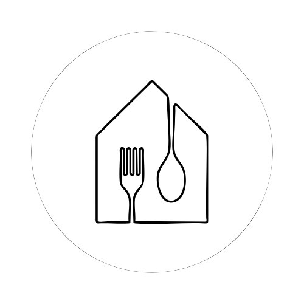

<p align="center">
  
</p>

# Oikos - Trattoria Moderna

Benvenuto nel repository del sito web di **Oikos - Trattoria Moderna**.
Questo progetto è sviluppato con [Next.js](https://nextjs.org/) e utilizza le più moderne tecnologie frontend per offrire un'esperienza utente elegante, veloce e responsive.

## Indice

- [Caratteristiche principali](#caratteristiche-principali)
- [Struttura del progetto](#struttura-del-progetto)
- [Tecnologie utilizzate](#tecnologie-utilizzate)
- [Installazione e avvio](#installazione-e-avvio)
- [Variabili d'ambiente](#variabili-d-ambiente)
- [Componenti e sezioni](#componenti-e-sezioni)
- [Deploy](#deploy)
- [Contatti](#contatti)

---

## Caratteristiche principali

- **Homepage** con sezioni dinamiche: Hero, Storia & Missione, Menu, Recensioni, Dove Siamo.
- **Prenotazione tavolo** tramite pagina dedicata e modale.
- **Design responsive** e moderno, ottimizzato per dispositivi mobili e desktop.
- **Autenticazione Basic** opzionale per proteggere l'accesso.
- **Animazioni** e carosello recensioni.
- **Integrazione con Google Maps** e social.

---

## Struttura del progetto

```
/app
  - layout.tsx         // Layout principale, font, Analytics
  - page.tsx           // Homepage
  - prenota/page.tsx   // Pagina prenotazione tavolo

/components
  - PrenotaModal.tsx   // Modale per prenotazione
  /sections
    - HeroSection.tsx
    - StoryMissionSection.tsx
    - MenuSection.tsx
    - ReviewsSection.tsx
    - LocationSection.tsx
  /ui
    - button.tsx, card.tsx, Footer.tsx, Navbar.tsx

/api
  - basic-auth.ts      // API di autenticazione base

/lib
  - utils.ts           // Utility CSS (merge classi Tailwind)

middleware.ts          // Middleware per autenticazione Basic
```

---

## Tecnologie utilizzate

- **Next.js 15** (App Router)
- **React 19**
- **Tailwind CSS 4**
- **TypeScript**
- **@radix-ui/react-slot, lucide-react, react-icons** (UI)
- **@vercel/analytics** (statistiche)
- **Class-variance-authority, clsx, tailwind-merge** (gestione classi CSS)
- **Custom middleware** per autenticazione Basic

---

## Installazione e avvio

1. **Clona il repository:**
   ```bash
   git clone <repo-url>
   cd oikos-website
   ```

2. **Installa le dipendenze:**
   ```bash
   npm install
   # oppure
   yarn install
   ```

3. **Avvia il server di sviluppo:**
   ```bash
   npm run dev
   # oppure
   yarn dev
   ```

4. **Visita:**
   [http://localhost:3000](http://localhost:3000)

---

## Variabili d'ambiente

Il sito può essere protetto da autenticazione Basic tramite il middleware (`middleware.ts`).
Per configurare le credenziali, crea un file `.env.local` nella root del progetto e aggiungi le seguenti variabili:

```
BASIC_AUTH_USER=nome_utente
BASIC_AUTH_PASS=password
```

Se non vengono fornite, le credenziali di default sono:
- **Utente:** `admin`
- **Password:** `oxystudio`

---

## Componenti e sezioni

### Homepage (`/`)

- **HeroSection:** Immagine di copertina, benvenuto e claim.
- **StoryMissionSection:** Storia e missione del ristorante, con immagini.
- **MenuSection:** Descrizione del menu, pulsanti per prenotare e scoprire il menù.
- **ReviewsSection:** Carosello di recensioni animate da clienti reali.
- **LocationSection:** Indirizzo, orari, bottoni per prenotare e vedere la mappa, link social.

### Navbar e Footer

Componenti riutilizzabili per la navigazione e il footer, con branding e link utili.

### Prenotazione tavolo

- **Modale di prenotazione:**
  Accessibile dalla homepage tramite pulsante, permette di inserire nome, email, telefono, data, orario e numero di persone.
  Invio dati tramite chiamata POST a `/api/prenota`.

- **Pagina dedicata (`/prenota`):**
  Stessa logica della modale, ma in pagina separata.

- **Gestione stato:**
  Feedback di successo o errore, validazione campi, loading durante l'invio.

---

## Deploy

Il deploy consigliato è su [Vercel](https://vercel.com/), ma puoi utilizzare qualsiasi piattaforma compatibile con Next.js.

---

## Contatti

- **Indirizzo:** Via Flaminia Nuova 230/232, 00191 Roma, Italia
- **Instagram:** [instagram.com](https://instagram.com)
- **Tripadvisor:** [tripadvisor.it](https://tripadvisor.it)

---

Se hai bisogno di ulteriori dettagli tecnici o vuoi personalizzare il progetto, consulta i file sorgente o contattaci!